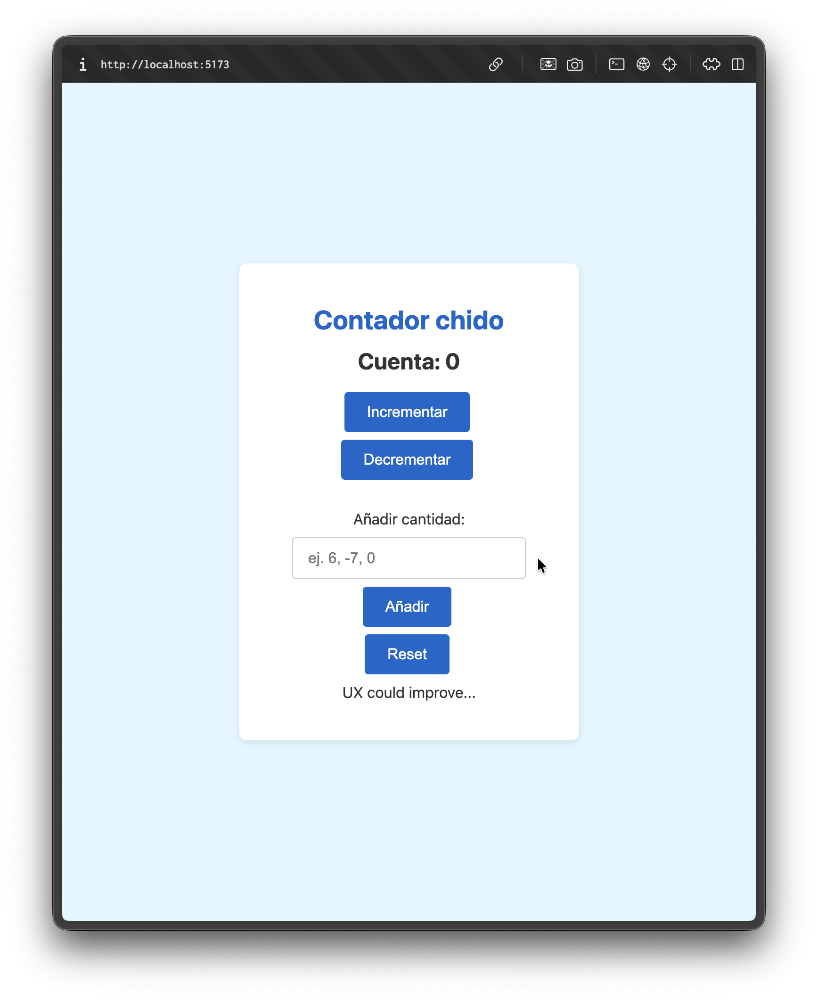

# counter app

This is a vite react app that has a simple counter component being rendered on app.jsx. The counter can be used to increment 1 by one, decrement 1 by 1, or add or decrement a custom amount, it has some validations so the counter doesn't go bellow 0. This project was built to practice the managing state and user inputs.

## Run project
1. install dependencies `npm install`
2. run in dev mode `npm run dev`

## Learnings and challenges
Managing the use input plus managing the functions being called on the buttons and the relationship between those was interesting.

## React + Vite 
This template provides a minimal setup to get React working in Vite with HMR and some ESLint rules.

Currently, two official plugins are available:

- [@vitejs/plugin-react](https://github.com/vitejs/vite-plugin-react/blob/main/packages/plugin-react) uses [Babel](https://babeljs.io/) (or [oxc](https://oxc.rs) when used in [rolldown-vite](https://vite.dev/guide/rolldown)) for Fast Refresh
- [@vitejs/plugin-react-swc](https://github.com/vitejs/vite-plugin-react/blob/main/packages/plugin-react-swc) uses [SWC](https://swc.rs/) for Fast Refresh

## React Compiler

The React Compiler is enabled on this template. See [this documentation](https://react.dev/learn/react-compiler) for more information.

Note: This will impact Vite dev & build performances.

## Expanding the ESLint configuration

If you are developing a production application, we recommend using TypeScript with type-aware lint rules enabled. Check out the [TS template](https://github.com/vitejs/vite/tree/main/packages/create-vite/template-react-ts) for information on how to integrate TypeScript and [`typescript-eslint`](https://typescript-eslint.io) in your project.
